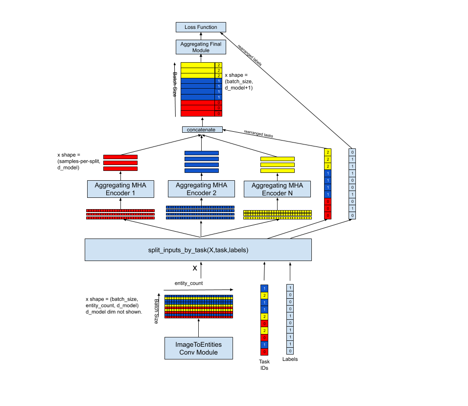
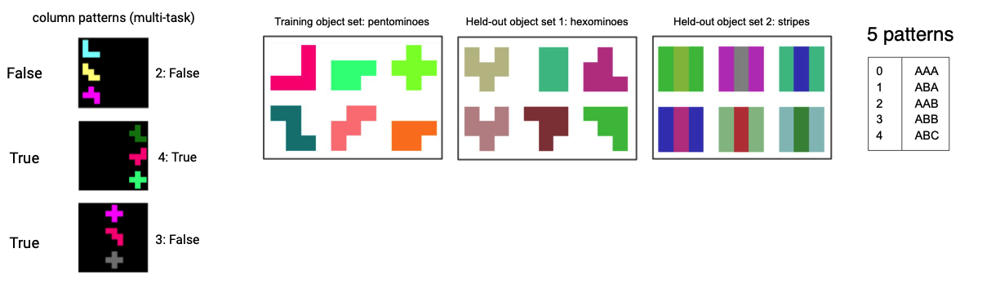

# Branching Image Processor with Aggregating MHA Encoders
Multi-Head Attention Neural Network for Image Datasets with Multiple Classification Tasks

This fully functioning notebook implements an architecture for processing an image dataset which contains multiple classification tasks.

Each batch of images is passed through an ImageToEntities module which creates entitities representing convolutional output features.  The samples in batch are then split by classification task, and passed though a parallel set of MHA Encoders -- one per classification task in the dataset. 
This is similar to the image-handling approach in ["Relational Deep Reinforcement Learning"](https://arxiv.org/abs/1806.01830).

Each of these AggregatingMHAEncoders consists of N stacks of MHA/Normalization/Feed-Forward layers, based upon the encoder portion of the encoder/decoder architecture originally described in ["Attention is All You Need"](https://arxiv.org/abs/1706.03762).  A final layer in each AggregatingMHAEncoder -- either a Max Pooling function, or "AggegatedMHA" function -- reduces the dimensionality of each encoders output.  

The sub-batches output by the encoders is then re-combined into a single batch for a final module, with each sample in the batch concatenated with it's associated classification task, and this recombined batch is then passed to a final feed-forward layer.

Each of these architectural elements are shown in more detail in diagrams in the notebook.

# Multi-task Dataset

For training and testing, this repository contains one dataset from ["An Explicitly Relational Neural Network Architecture"](https://arxiv.org/abs/1905.10307). 
Each sample in the dataset contains an image, a label, and a task id.   Sample images are shown on the left below, each with it's associated task id and True/False label.
With each image, the task id refers to one of the "5 patterns" shown on the far right, and the target label indicates whether the three shapes correspond to that pattern.
Quoting from the paper:  "The training object set contains 8 uniformly coloured pentominoes and their rotations and reflections (37 shapes in all) with 25 possible colours. The first held-out object set contains 8 uniformly coloured hexominoes and their rotations and reflections (46 shapes in all) with 25 possible colours, and the second held-out object set contains only squares, but with a striped pattern of held-out colours."

The training set has 250,000 samples.  Each of the test sets have 20,000 samples.

# Tensorflow Graphs

The tensorflow graphs below show results of running my model on the "held-out" dataset (stripes), recorded every check-interval during training the data set (pentominoes).
The first graphs shows the result using AggregatingMultiHeadedAttention as the "final module".
The second graph shows the result when using a Max Function.
Clearly, for this dataset the modules yield similar results, although the Max Function appears a bit less volatile.
